# EasyMLOps (WIP)

A turnkey MLOps pipeline demonstrating how to go from raw events to real-time predictions at scale. This project leverages modern data engineering and ML platforms—including Kafka, Flink, Redis, Ray, and more—to provide an end-to-end solution for data ingestion, validation, training, serving, and observability.

## 🌐 Architecture Overview


The system comprises four main pipelines—**Data**, **Training**, **Serving**, and **Observability**—alongside a **Dev Environment** and a **Model Registry**.

---

### 1. Data Pipeline

#### a. Producers & CDC

- Multiple producers emit raw events to **Kafka** (`tracking.raw_user_behavior`).
- A **Debezium-based CDC** service captures and streams changes from PostgreSQL into **Kafka** (`tracking_postgres_cdc.public.events`).

#### b. Validation Service (Flink)

- Consumes raw and CDC events from Kafka.
- Validates schemas, splitting events into:
  - **Validated Topic** (`tracking.user_behavior.validated`)
  - **Invalidated Topic** (`tracking.user_behavior.invalid`)

#### c. DataLake (MinIO)

- **Kafka → S3 Sink Connectors** write validated and invalid data to **MinIO**.
- No data is lost—this approach follows `EtLT` (Extract, transform, Load, Transform).
- Ensures permanent storage of both raw and invalid events for alerting or recovery.

#### d. Data Warehouse (PostgreSQL)

- **Airflow DAGs** orchestrate the ETL flow (Bronze → Silver → Gold tables):
  - Ingest raw data from MinIO.
  - Perform quality checks and transformations.
  - Create dimension, fact, and feature tables.
  - Re-check data quality on final “gold” tables.

#### e. Online Store (Redis)

- Real-time ingestion of features:
  - **Flink Jobs** or custom Python scripts convert validated events into feature-ready topics.
  - **Feast** or custom ingestion pipelines populate Redis for low-latency feature retrieval.

---

### 2. Training Pipeline

#### a. Distributed Training with Ray

- **`load_training_data`**: Pulls features from the “gold” tables in the Data Warehouse.
- **`tune_hyperparameters`**: Uses **Ray Tune** for distributed hyperparameter optimization.
- **`train_final_model`**: Trains the final model (e.g., XGBoost) using the best hyperparameters.

#### b. Model Registry

- **MLflow + MinIO** to store model artifacts, metrics, and versioned checkpoints.
- Facilitates model discovery, lineage, and rollout/rollback.

#### c. Manual Training Option

- **Jupyter notebooks** (`notebook/train.ipynb`) provide custom or ad hoc workflows.

---

### 3. Serving Pipeline

#### a. Real-Time Inference (Ray Serve)

- **Ray Serve** hosts the trained model.
- Model checkpoints loaded from **MLflow** in MinIO.
- Real-time features fetched from **Redis** (Online Store).

#### b. Feature Retrieval Services

- A dedicated microservice (e.g., **FastAPI**) or Flink job for on-demand feature retrieval.
- Streams or scheduled updates keep **Redis** current.

#### c. Scalability & Performance

- **Ray Serve** scales horizontally under heavy workloads.
- **NGINX** acts as a reverse proxy, routing requests efficiently.

---

### 4. Observability

#### a. OpenTelemetry Collector

- Collects, aggregates, and exports metrics, logs, and traces from various services.

#### b. SigNoz

- Consumes telemetry data from the OpenTelemetry Collector.
- Offers dashboards and alerting for monitoring the entire pipeline.

#### c. Prometheus & Grafana

- Scrapes and visualizes **Ray Cluster** metrics.
- Provides insights into resource usage, job status, and cluster health.

---

### Dev Environment

#### a. Jupyter Notebooks

- Facilitates data exploration, rapid prototyping, and debugging.
- Integrated with the rest of the pipeline for end-to-end local development.

#### b. Docker Compose Services

- Local spins of **Kafka**, **Flink**, **Redis**, **Airflow**, etc.
- Simplifies debugging and testing by emulating production environments.

---

### Model Registry

#### a. MLflow UI

- Access at `http://localhost:5001`.
- Stores experiment runs, parameters, metrics, and artifacts.

#### b. MinIO

- Serves as the artifact storage backend for MLflow.
- Manages versioned model binaries and other metadata.

---

By combining streaming ingestion (**Kafka** + **Flink**), persistent storage (**MinIO** + **PostgreSQL**), orchestration (**Airflow**), distributed training/serving (**Ray**), and observability (**SigNoz**, **Prometheus/Grafana**), **EasyMLOps** provides a robust, modular pipeline—from raw data to real-time predictions at scale.

---

## ⚙️ Usage

All available commands can be found in the `Makefile`.

---

## 📖 Details

In this section, we will dive into the details of the system.

### Setup environment variables

Please run the following command to setup the `.env` files:

```bash
cp .env.example .env
cp ./src/cdc/.env.example ./src/cdc/.env
cp ./src/model_registry/.env.example ./src/model_registry/.env
cp ./src/orchestration/.env.example ./src/orchestration/.env
cp ./src/producer/.env.example ./src/producer/.env
cp ./src/streaming/.env.example ./src/streaming/.env
```

Note: I don't use any secrets in this project, so run the above command and you are good to go.

### Start Data Pipeline

I will use the same network for all the services, first we need to create the network.

```bash
make up-network
```

#### Start Kafka

```bash
make up-kafka
```

The last service in the `docker-compose.kafka.yaml` file is `kafka_producer`, this service acts as a producer and will start sending messages to the `tracking.raw_user_behavior` topic.

To check if Kafka is running, you can go to `http://localhost:9021/` and you should see the Kafka dashboard. Then go to the `Topics` tab and you should see `tracking.raw_user_behavior` topic.

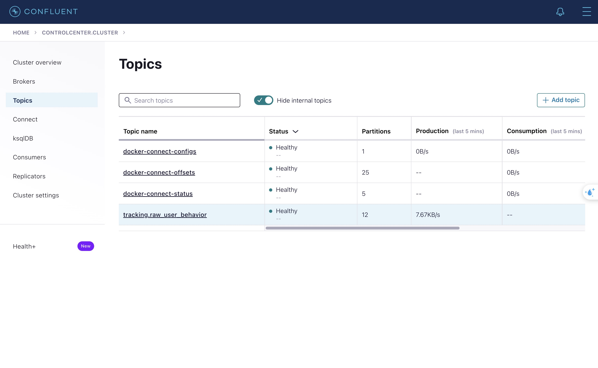

To check if the producer is sending messages, you can click on the `tracking.raw_user_behavior` topic and you should see the messages being sent.

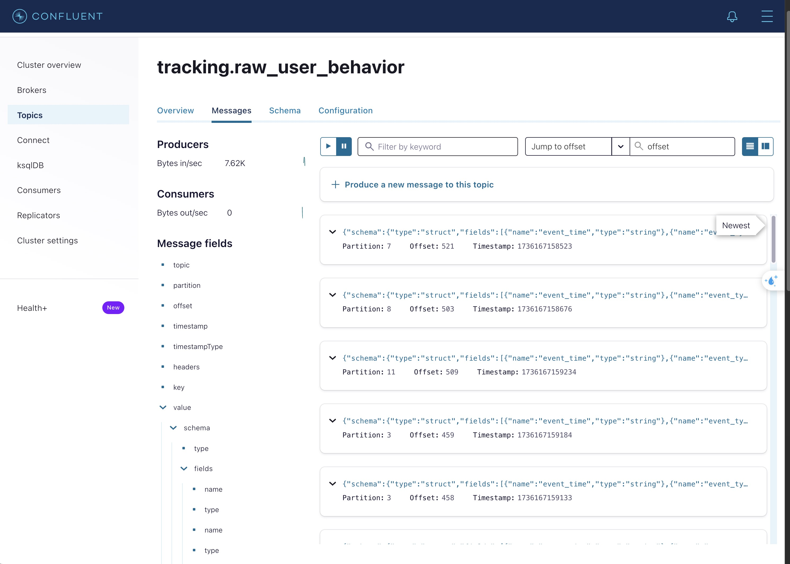

Here is an example of the message's value in the `tracking.raw_user_behavior` topic:

```json
{
  "schema": {
    "type": "struct",
    "fields": [
      {
        "name": "event_time",
        "type": "string"
      },
      {
        "name": "event_type",
        "type": "string"
      },
      {
        "name": "product_id",
        "type": "long"
      },
      {
        "name": "category_id",
        "type": "long"
      },
      {
        "name": "category_code",
        "type": ["null", "string"],
        "default": null
      },
      {
        "name": "brand",
        "type": ["null", "string"],
        "default": null
      },
      {
        "name": "price",
        "type": "double"
      },
      {
        "name": "user_id",
        "type": "long"
      },
      {
        "name": "user_session",
        "type": "string"
      }
    ]
  },
  "payload": {
    "event_time": "2019-10-01 02:30:12 UTC",
    "event_type": "view",
    "product_id": 1306133,
    "category_id": "2053013558920217191",
    "category_code": "computers.notebook",
    "brand": "xiaomi",
    "price": 1029.37,
    "user_id": 512900744,
    "user_session": "76b918d5-b344-41fc-8632-baf222ec760f"
  }
}
```

#### Start CDC

```bash
make up-cdc
```

Next, we start the CDC service. This Docker Compose file contains:

- Debezium
- PostgreSQL db
- A Python service that registers the connector, creates the table, and inserts the data into PostgreSQL.

The data automatically syncs from PostgreSQL to the `tracking_postgres_cdc.public.events` topic. To confirm, go to the `Connect` tab in the Kafka UI; you should see a connector called `cdc-postgresql`.


Return to `http://localhost:9021/`; there should be a new topic called `tracking_postgres_cdc.public.events`.

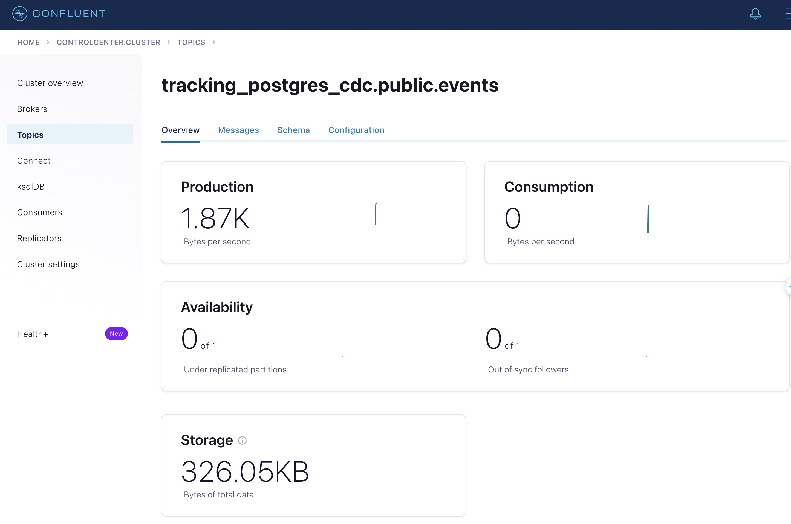

### Start Schema Validation Job

```bash
make schema_validation
```

This is a Flink job that will consume the `tracking_postgres_cdc.public.events` and `tracking.raw_user_behavior` topics and validate the schema of the events. The validated events will be sent to the `tracking.user_behavior.validated` topic and the invalid events will be sent to the `tracking.user_behavior.invalid` topic, respectively. For easier to understand, I don't push these flink jobs into a docker compose file, but you can do it if you want. Watch the terminal to see the job running, the log may look like this:

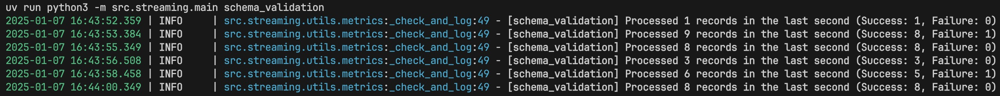

After starting the job, you can go to `http://localhost:9021/` and you should see the `tracking.user_behavior.validated` and `tracking.user_behavior.invalid` topics.

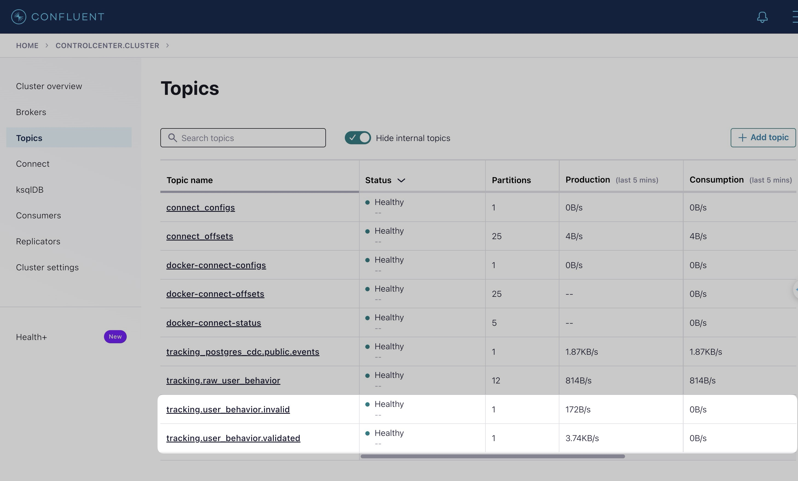

### Start Data Lake

```bash
make up-data-lake
```

This is a MinIO instance that will store both the validated and invalidated events, ensuring no data is lost. MinIO is compatible with the Amazon S3 API, Google Cloud Storage, and Azure Blob Storage, so you can use any S3 client to interact with it. I have already created a simple alert to monitor the invalidated events in `src/streaming/jobs/alert_invalid_events_job.py`. Just run `alert_invalid_events` to see the alert in action.

In order to sync the data from the `tracking.user_behavior.validated` and `tracking.user_behavior.invalid` topics to the MinIO, we need to deploy the S3 connector.

```bash
make deploy_s3_connector
```

Go to the `http://localhost:9021/` (default user and password is `minioadmin:minioadmin`) at the `Connect` tab and you should see a new connector called `minio-validated-sink` and `minio-invalidated-sink`.

To see the MinIO UI, you can go to `http://localhost:9001/`. There are 2 buckets, `validated-events-bucket` and `invalidated-events-bucket`, you can go to each bucket and you should see the events being synced.

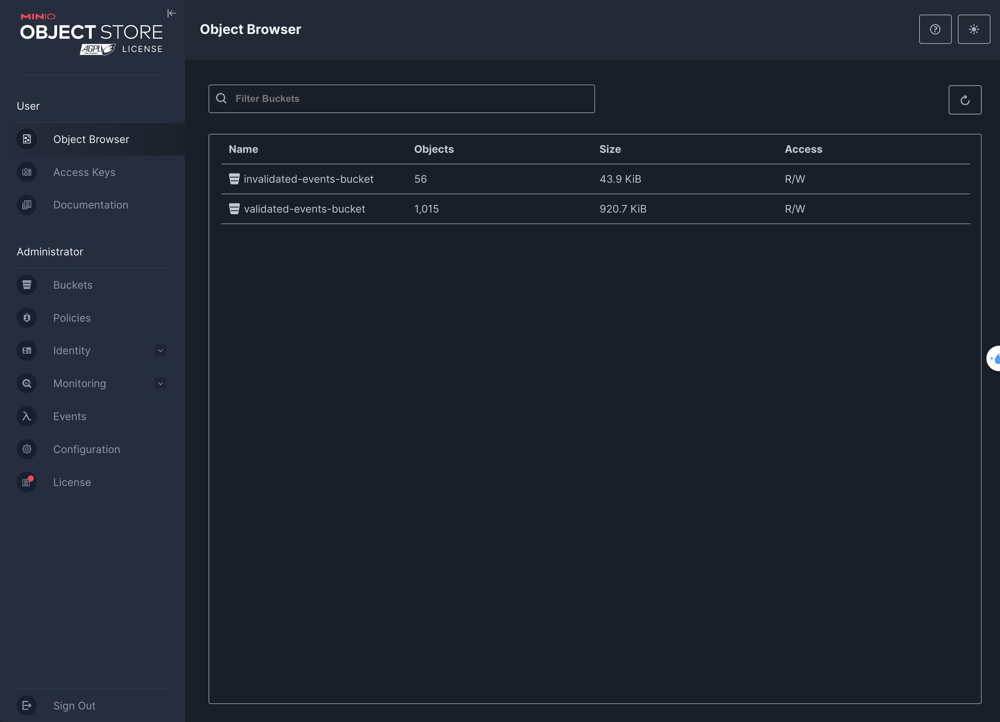

Each record in buckets is a JSON file, you can click on the file and you should see the event.

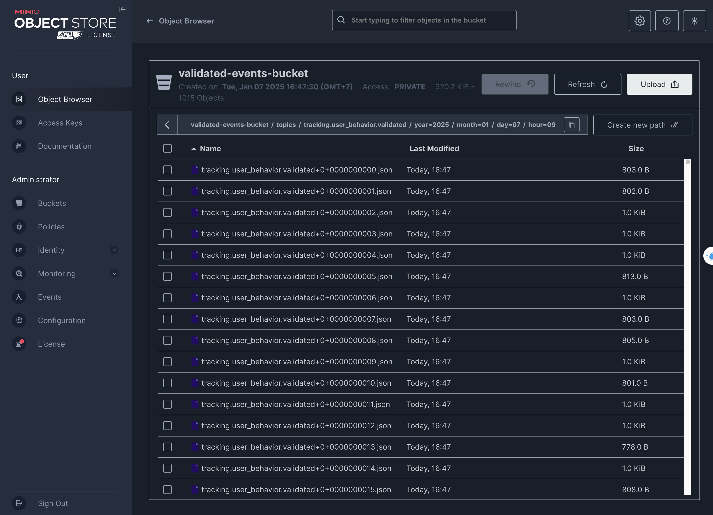

### Start Orchestration

```bash
make up-orchestration
```

This will start the Airflow service and the other services that are needed for the orchestration. Here is the list of services that will be started:

- MinIO (Data Lake)
- PostgreSQL (Data Warehouse)
- Ray Cluster
- MLflow (Model Registry)
- Prometheus & Grafana (for Ray monitoring)

Relevant URLs:

- MinIO UI: `http://localhost:9001/`
- Airflow UI: `http://localhost:8080/` (user/password: `airflow:airflow`)
- Ray Dashboard: `http://localhost:8265/`
- Grafana: `http://localhost:3009/`
- MLflow UI: `http://localhost:5001/`

### Data and Training Pipeline

Go to the Airflow UI (default user and password is `airflow:airflow`) and you should see the `data_pipeline` and `training_pipeline` DAGs. These 2 DAGs are automatically triggered, but you can also trigger them manually.

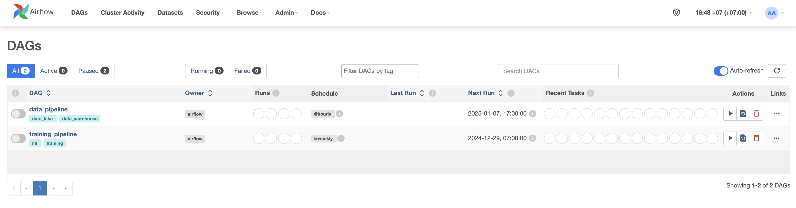

#### 🔄 Data Pipeline

The `data_pipeline` DAG is composed of six tasks, divided into three layers:

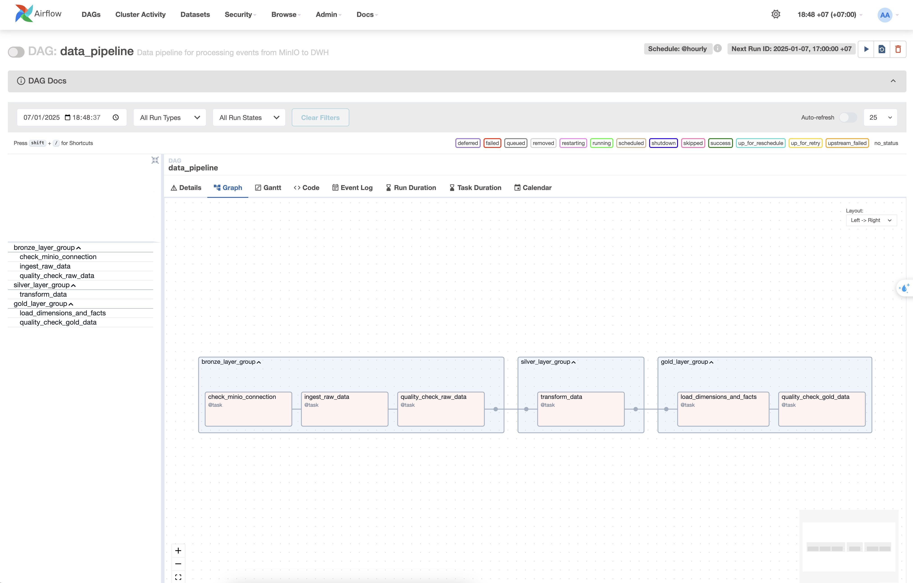

##### Bronze Layer:

1. **check_minio_connection** - Ensures a stable connection to the MinIO Data Lake for storing raw data.
2. **ingest_raw_data** - Ingests raw data from Data Lake.
3. **quality_check_raw_data** - Performs validations on the ingested raw data, ensuring data integrity.

##### Silver Layer:

4. **transform_data** - Cleans and transforms validated raw data, preparing it for downstream usage.

##### Gold Layer:

5. **load_dimensions_and_facts** - Creates dimension and fact tables in the data warehouse.
6. **quality_check_gold_data** - Conducts final quality checks on the "gold" tables to ensure the data is accurate and reliable for model training and analysis.

Trigger the `data_pipeline` DAG, and you should see the tasks running. This DAG will take some time to complete, but you can check the logs in the Airflow UI to see the progress. For simplicity, I hardcoded the `MINIO_PATH_PREFIX` to `topics/tracking.user_behavior.validated/year=2025/month=01`. Ideally, you should use the actual timestamp for each run. For example, `validated-events-bucket/topics/tracking.user_behavior.validated/year=2025/month=01/day=07/hour=XX`, where XX is the hour of the day.

I also use checkpointing to ensure the DAG is resilient to failures and can resume from where it left off, the checkpoint is stored in the Data Lake, just under the `MINIO_PATH_PREFIX`, so if the DAG fails, you can simply trigger it again, and it will resume from the last checkpoint.

**Note**: One thing you could improve is to use `Spark` or `Ray` to load and process the data. In my case, I want to use Ray to load and process the data, but sadly I got some issues and didn't have time to fix it.

#### 🤼‍♂️ Training Pipeline

The `training_pipeline` DAG is composed of four tasks:

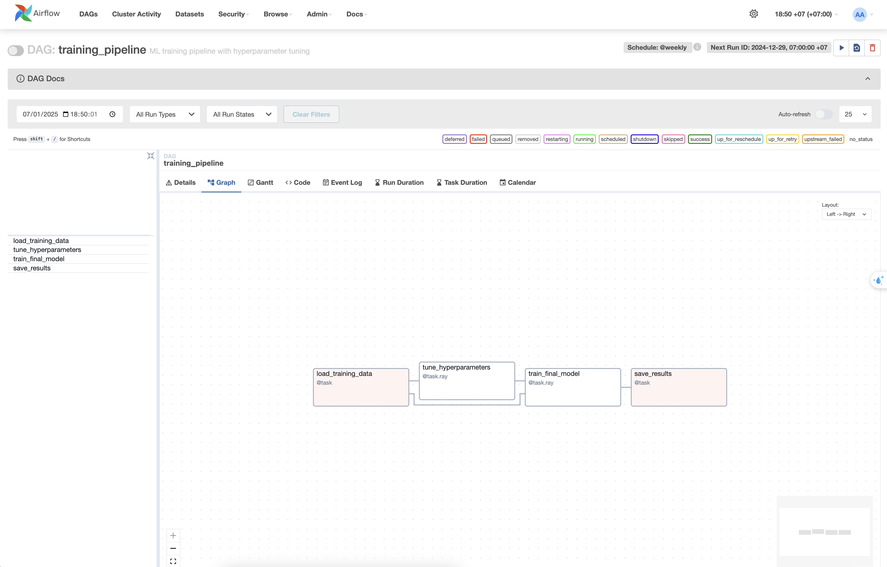

1. **load_training_data** - Pulls processed data from the data warehouse for use in training the machine learning model.
2. **tune_hyperparameters** - Utilizes Ray Tune to perform distributed hyperparameter tuning, optimizing the model's performance.
3. **train_final_model** - Trains the final machine learning model using the best hyperparameters from the tuning phase.
4. **save_results** - Saves the trained model and associated metrics to the Model Registry for future deployment and evaluation.

Trigger the `training_pipeline` DAG, and you should see the tasks running. This DAG will take some time to complete, but you can check the logs in the Airflow UI to see the progress.


After hit the `Trigger DAG` button, you should see the tasks running. The `tune_hyperparameters` task will `deferred` because it will submit the Ray Tune job to the Ray Cluster and use polling to check if the job is done. The same happens with the `train_final_model` task.

When the `tune_hyperparameters` or `train_final_model` tasks are running, you can go to the Ray Dashboard at `http://localhost:8265` and you should see the tasks running.

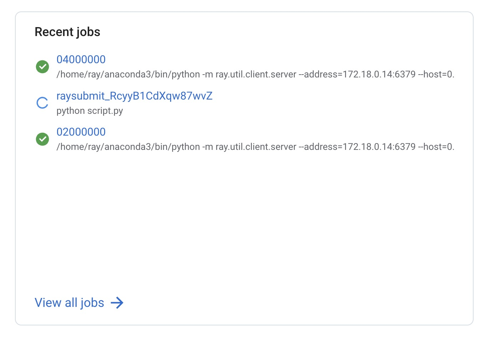

Click on the task and you should see the task details, including the id, status, time, logs, and more.

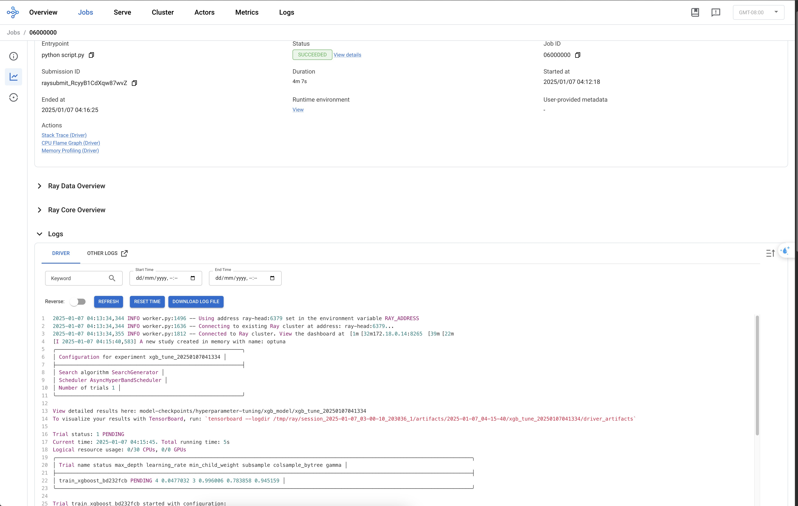

To see the results of the training, you can go to the MLflow UI at `http://localhost:5001` and you should see the training results.

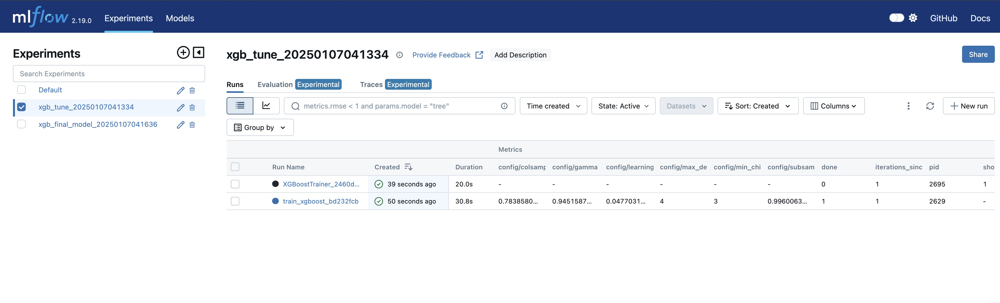

The model will be versioned in the Model Registry, you can go to the `http://localhost:5001/` and hit the `Models` tab and you should see the model.

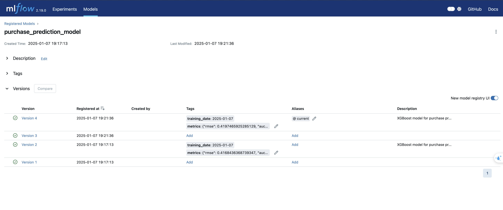

### 📦 Start Online Store

```bash
make up-online-store
```

This command will start the Online Store as well as the Serving Pipeline.

Look at the `docker-compose.online-store.yaml` file, you will see 2 services, the `redis` service and the `feature-retrieval` service. The `redis` service is the Online Store, and the `feature-retrieval` service is the Feature Retrieval service.

The `feature-retrieval` service is a Python service that will run the following commands:

```bash
python setup.py # Setup the feature store
python materialize_features.py # Materialize the features from Data Warehouse to Redis, highly recommend to run this in a cron job
python api.py # Start a simple FastAPI app to retrieve the features
```

To view the Swagger UI, you can go to `http://localhost:8001/docs`.

The `redis` service is a Redis instance that will store the features.

#### Syncing Data from Kafka to Redis

First, we need to start the `validated_events_to_features` job, this job will consume the `tracking.user_behavior.validated` topic, process the data, and store it in the `model.features.ready` topic.

```bash
make validated_events_to_features
```

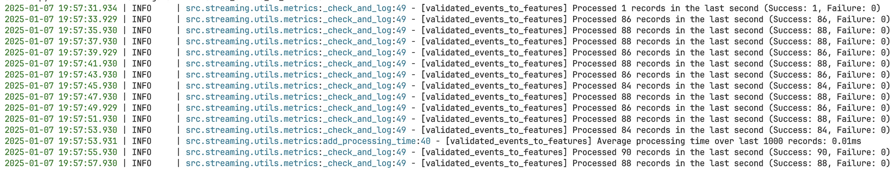

Then, we need to start the `kafka_to_feast_online_store` job, this job will consume the `model.features.ready` topic, process the data, and store it in the Redis Online Store.

```bash
make kafka_to_feast_online_store
```

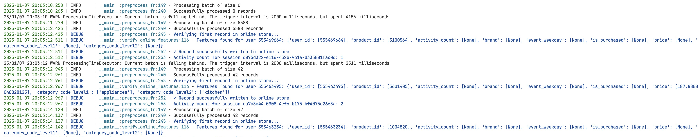

This command will cd to `src/feature_stores`, create a virtual environment, activate it, install the dependencies, and run the `ingest_stream_to_online_store.py` script. This script will consume the `tracking.user_behavior.validated` topic, process the data, and store it in the `model.features.ready` topic.

Here is an example of the record in the `model.features.ready` topic:

```json
{
  "event_timestamp": "2019-10-01 02:40:47 UTC",
  "user_id": 555464681,
  "product_id": 2402894,
  "user_session": "10d6b1d6-951f-4e5a-a650-eb567c9ed3a1",
  "event_type": "view",
  "category_code": "appliances.kitchen.hood",
  "price": 162.54,
  "brand": "zorg",
  "category_code_level1": "appliances",
  "category_code_level2": "kitchen",
  "processed_at": "2025-01-07T13:06:47.930295"
}
```

### 🚀 Start Serving Pipeline

```bash
make up-serving
```

This command will start the Serving Pipeline. Note that we did not portfward the `8000` port in the `docker-compose.serving.yaml` file, but we just expose it. The reason is that we use Ray Serve, and the job will be submitted to the Ray Cluster. That is the reason why you see the port `8000` in the `docker-compose.serving.ray` file instead of the `docker-compose.serving.yaml` file.

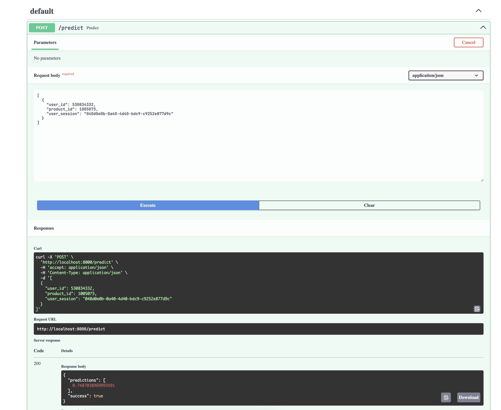

### 🔎 Start Observability

#### Signoz

```bash
make up-observability
```

This command will start the Observability Pipeline. This is a SigNoz instance that will receive the data from the OpenTelemetry Collector. Go to `http://localhost:3301/` and you should see the SigNoz dashboard.

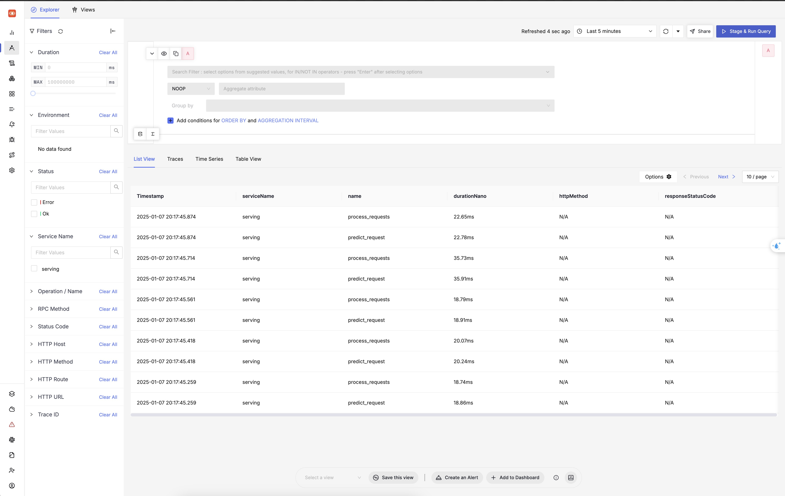

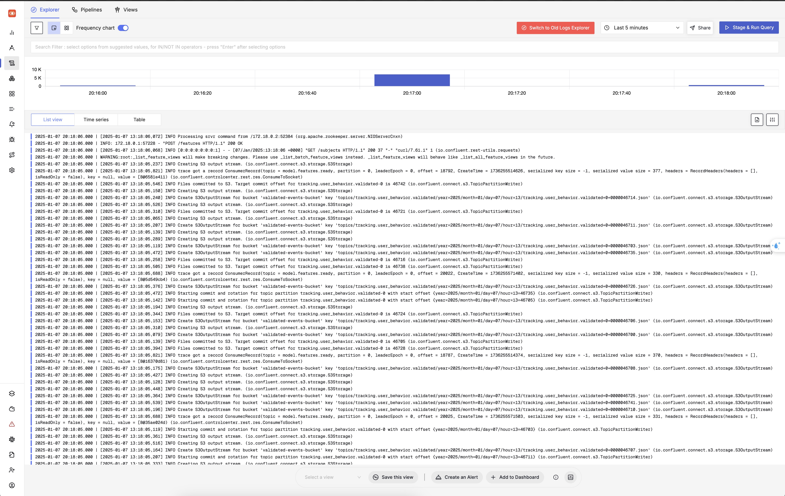

#### Prometheus and Grafana

To see the Ray Cluster information, you can go to `http://localhost:3009/` and you should see the Grafana dashboard.

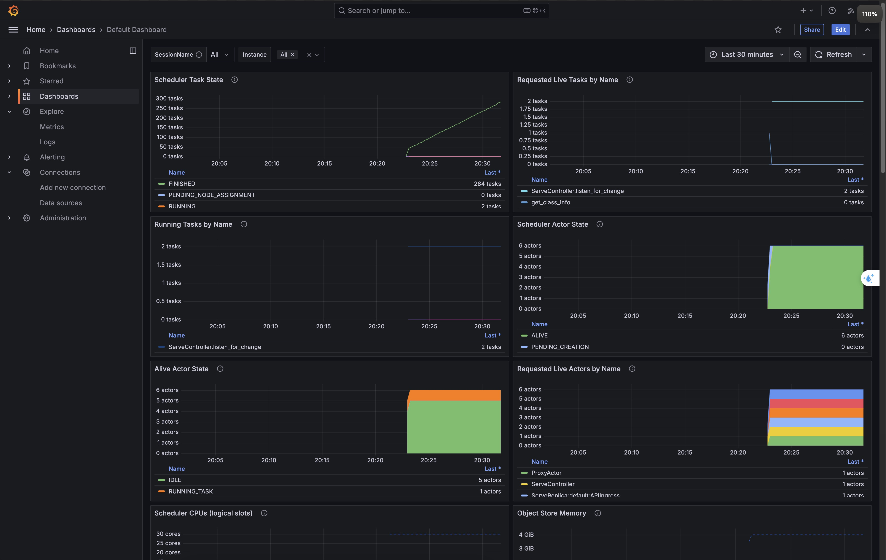

### NGINX

```bash
make up-nginx
```

This command will start the NGINX Proxy Manager, you can go to `http://localhost:81/` and you should see the NGINX Proxy Manager UI. The default user and password is `admin@example.com:changeme`. Then you can setup the reverse proxy for the Ray Dashboard, MLflow, Airflow, and more. For SSL, you can use the Let's Encrypt, and for domain, you can use DuckDNS.

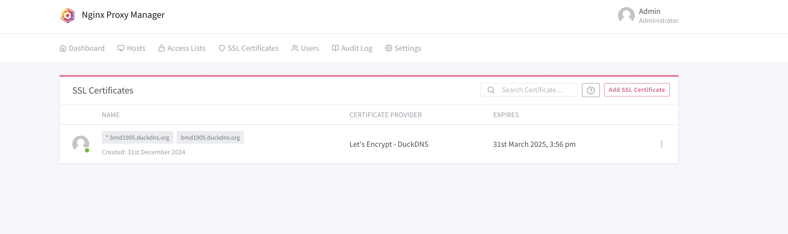

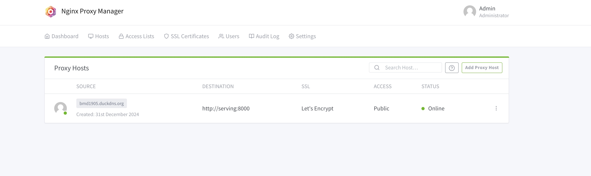

---

## 📃 License

This project is provided under an MIT license. See the [LICENSE](LICENSE) file for details.
