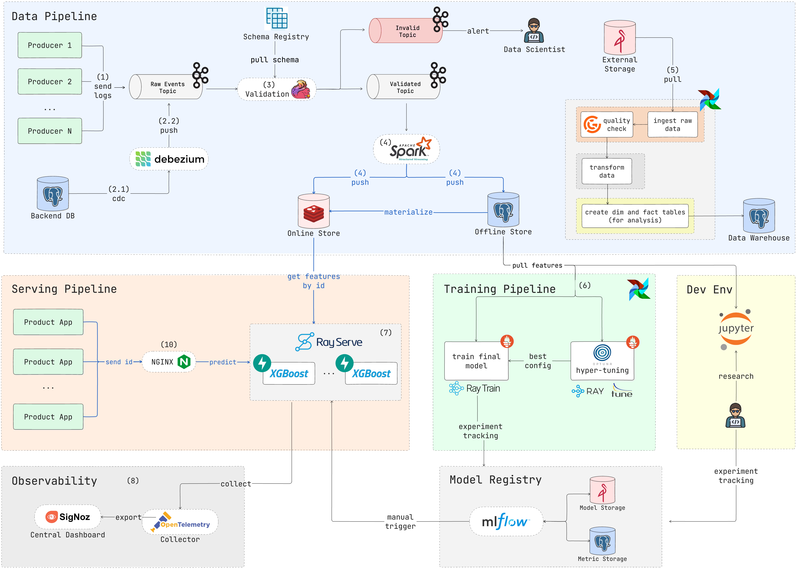

# EasyMLOps

## Current Flows

### Data Pipeline

- Multiple `Producers` act as sources of raw events and produce data to the Kafka `Raw Events Topic`.

- A `Validation Service` consumes data from the `Raw Events Topic`, validates it, and publishes to either:

  - The `Validated Topic` for valid data
  - The `Invalidated Topic` for invalid data

- The `Invalidated Topic` triggers an alerting system to send email notifications via Gmail to stakeholders about invalid data.

- The `Validated Topic` is synchronized with:

  - The `DataLake` for persistent storage and further processing
  - The `Online Store` (Redis) for real-time feature serving

- The Data Warehouse (Offline Store) processing workflow is orchestrated by `Airflow DAGs`:
  - Ingest raw data from the DataLake
  - Validate raw data
  - Transform data
  - Create feature views
  - Create dimension and fact tables

### Training Pipeline

- The `Ray Train` framework handles distributed model training:

  - Load_data Task: Pulls features from the Data Warehouse
  - Train_model Task: Trains the model using distributed computing

- The `MLflow` Model Registry:
  - Stores model checkpoints and metrics
  - Integrates with Jupyter notebooks in the Dev Environment
  - Pushes metrics and weights for model analysis

### Serving Pipeline

- `RayServe` with `XGBoost` handles model serving:
  - Loads model checkpoints from MLflow
  - Pulls real-time features from the Online Store
  - Serves predictions to the Product App

### Observability

- OpenTelemetry Collector gathers telemetry data from the serving pipeline
- SigNoz serves as the Central Dashboard for monitoring:
  - Collects metrics exported from OpenTelemetry
  - Provides visibility into system performance and health

## Usage

Check the `Makefile` for all the commands you can use.
