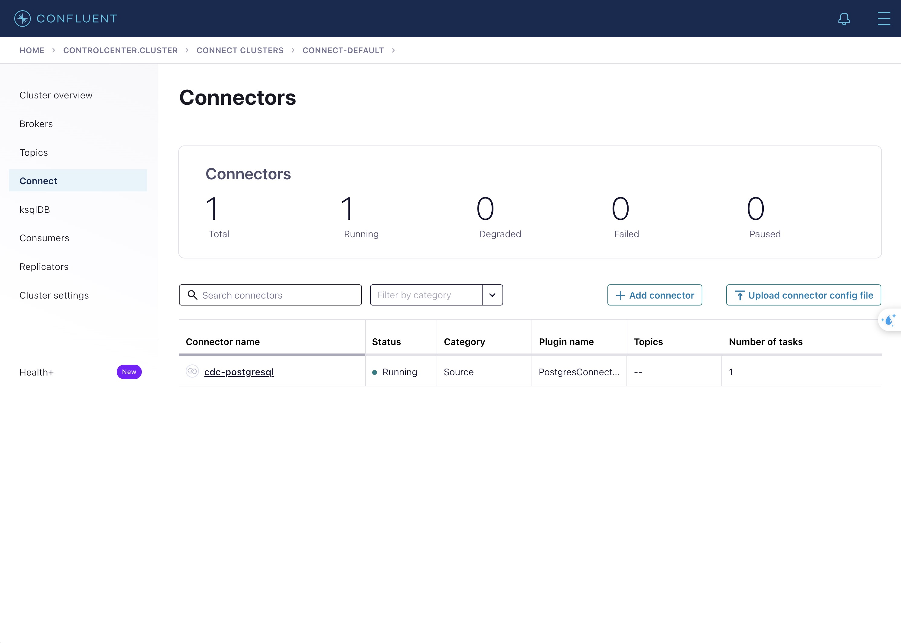

# EasyMLOps (WIP)

A turnkey MLOps pipeline demonstrating how to go from raw events to real-time predictions at scale. This project leverages modern data engineering and ML platforms—including Kafka, Flink, Redis, Ray, and more—to provide an end-to-end solution for data ingestion, validation, training, serving, and observability.

## 🌐 Architecture Overview

<!--  -->

The system is composed of four main pipelines—Data, Training, Serving, and Observability—along with a Dev Environment and a Model Registry.

---

### 🔄 1. Data Pipeline

1. **Producers**
   Multiple producers emit raw events to the **Kafka `Raw Events Topic`**.

2. **Validation Service**
   A Flink job consumes raw events, validates their schema, and routes them accordingly:

   - **`Validated Topic`** for valid data
   - **`Invalidated Topic`** for invalid data

3. **DataLake and Online Store**

   - **Validated Topic → DataLake (MinIO)**
     For permanent storage and downstream batch processing.
   - **Validated Topic → Online Store (Redis)**
     For real-time feature retrieval.

4. **Data Warehouse (Offline Store)**
   Orchestrated by **Airflow DAGs**, which:
   - Ingest raw data from the DataLake
   - Perform quality checks and transformations
   - Create dimension, fact, and feature tables
   - Re-check data quality on the final “gold” tables

---

### 🤼‍♂️ 2. Training Pipeline

1. **Distributed Training with Ray**

   - `get_data`: Pulls features from the Data Warehouse
   - `hyper_parameter_tuning`: Conducts hyperparameter tuning using Ray Tune
   - `train_final_model`: Trains the final model with the best hyperparameters

2. **Model Registry**

   - **MLflow and MinIO** store model weights, metrics, and artifacts.

3. **Manual Training Option**
   - Jupyter notebooks (`notebook/train.ipynb`) allow a custom or ad hoc workflow.

---

### 🚀 3. Serving Pipeline

1. **Real-Time Inference**

   - **Ray Serve** hosts an **XGBoost** model.
   - Model checkpoints are loaded from the **Model Registry**.
   - Real-time feature retrieval comes from **Redis**.
   - Predictions are served to the **Product App** via **NGINX**.

2. **Scalability & Performance**
   - Ray Serve scales horizontally to handle high-throughput requests.
   - NGINX acts as a reverse proxy to route traffic efficiently.

---

### 🔎 4. Observability

1. **OpenTelemetry Collector**
   Aggregates telemetry data (metrics, traces, logs) from the Serving Pipeline.

2. **SigNoz**
   - Receives data exported from the OpenTelemetry Collector.
   - Provides a centralized dashboard for system health and performance monitoring.

---

### 💻 Dev Environment

- **Jupyter Notebooks** for data exploration, ad hoc experimentation, and manual model development.
- Integration with the rest of the pipeline (Data, Training, Serving) ensures an end-to-end experience even in development.

---

## ⚙️ Usage

All available commands can be found in the `Makefile`.

---

## 📖 Details

In this section, we will dive into the details of the system.

### Setup environment variables

Please run the following command to setup the `.env` files:

```bash
cp .env.example .env
cp ./src/cdc/.env.example ./src/cdc/.env
cp ./src/model_registry/.env.example ./src/model_registry/.env
cp ./src/orchestration/.env.example ./src/orchestration/.env
cp ./src/producer/.env.example ./src/producer/.env
cp ./src/streaming/.env.example ./src/streaming/.env
```

Note: I don't use any secrets in this project, so run the above command and you are good to go.

### Start Data Pipeline

I will use the same network for all the services, first we need to create the network.

```bash
make up-network
```

#### Start Kafka

```bash
make up-kafka
```

The last service in the `docker-compose.kafka.yaml` file is `kafka_producer`, this service acts as a producer and will start sending messages to the `tracking.raw_user_behavior` topic.

To check if Kafka is running, you can go to the `http://localhost:9021/` and you should see the Kafka dashboard. Then go to the `Topics` tab and you should see the `tracking.raw_user_behavior`.


To check if the producer is sending messages, you can click on the `tracking.raw_user_behavior` topic and you should see the messages being sent.


Here is an example of the message's value in the `tracking.raw_user_behavior` topic:

```json
{
  "schema": {
    "type": "struct",
    "fields": [
      {
        "name": "event_time",
        "type": "string"
      },
      {
        "name": "event_type",
        "type": "string"
      },
      {
        "name": "product_id",
        "type": "long"
      },
      {
        "name": "category_id",
        "type": "long"
      },
      {
        "name": "category_code",
        "type": ["null", "string"],
        "default": null
      },
      {
        "name": "brand",
        "type": ["null", "string"],
        "default": null
      },
      {
        "name": "price",
        "type": "double"
      },
      {
        "name": "user_id",
        "type": "long"
      },
      {
        "name": "user_session",
        "type": "string"
      }
    ]
  },
  "payload": {
    "event_time": "2019-10-01 02:30:12 UTC",
    "event_type": "view",
    "product_id": 1306133,
    "category_id": "2053013558920217191",
    "category_code": "computers.notebook",
    "brand": "xiaomi",
    "price": 1029.37,
    "user_id": 512900744,
    "user_session": "76b918d5-b344-41fc-8632-baf222ec760f"
  }
}
```

#### Start CDC

```bash
make up-cdc
```

Next, we need to start the CDC service. This Docker Compose file contains:

- Debezium
- PostgreSQL db
- A Python service that will register the connector, create the table, and insert the data into the PostgreSQL db.

The data is automatically synced from the PostgreSQL db to the `tracking_postgres_cdc.public.events` topic. To check if the connector is working, go to `Connect` tab and you should see a connector called `cdc-postgresql`.



Go back to the `http://localhost:9021/` and you should see a new topic called `tracking_postgres_cdc.public.events`.


### Start Schema Validation Job

```bash
make schema_validation
```

This is a Flink job that will consume the `tracking_postgres_cdc.public.events` and `tracking.raw_user_behavior` topics and validate the schema of the events. The validated events will be sent to the `validated-events-topic` and the invalid events will be sent to the `invalidated-events-topic`. For easier to understand, I don't push these flink jobs into a docker compose file, but you can do it if you want. Watch the terminal to see the job running.

### Start Data Lake

```bash
make up-data-lake
```

This is a MinIO instance that will store both the validated and invalidated events, ensuring no data is lost. MinIO is compatible with the Amazon S3 API, Google Cloud Storage, and Azure Blob Storage, so you can use any S3 client to interact with it. I have already created a simple alert to monitor the invalidated events in `src/streaming/jobs/alert_invalid_events_job.py`. Just run `alert_invalid_events` to see the alert in action.

In order to sync the data from the `validated-events-topic` and `invalidated-events-topic` to the MinIO, we need to deploy the S3 connector.

```bash
make deploy_s3_connector
```

Go to the `http://localhost:9021/` and you should see a new connector called `minio-validated-sink` and `minio-invalidated-sink`.

To see the MinIO UI, you can go to `http://localhost:9001/`.

### Start Orchestration

```bash
make up-orchestration
```

This will start the Airflow service and the other services that are needed for the orchestration. Here is the list of services that will be started:

- Data Lake (MinIO)
- Data Warehouse (PostgreSQL)
- Ray Cluster
- Model Registry (MLflow)
- Grafana and Prometheus (visualize Ray Cluster)

Here are the URLs to access the different services:

- MinIO UI: `http://localhost:9001/`
- Airflow UI: `http://localhost:8080/`
- Ray Dashboard: `http://localhost:8265/`
- Grafana Dashboard: `http://localhost:3009/`
- MLflow UI: `http://localhost:5001/`

### Data and Training Pipeline

Go to the Airflow UI and you should see the `data_pipeline` and `training_pipeline` DAGs. These 2 DAGs are automatically triggered, but you can also trigger them manually.

#### 🔄 Data Pipeline

The `data_pipeline` DAG is composed of six tasks, divided into three layers:

##### Bronze Layer:

1. **check_minio_connection** - Ensures a stable connection to the MinIO Data Lake for storing raw data.
2. **ingest_raw_data** - Ingests raw data from Data Lake.
3. **quality_check_raw_data** - Performs validations on the ingested raw data, ensuring data integrity.

##### Silver Layer:

4. **transform_data** - Cleans and transforms validated raw data, preparing it for downstream usage.

##### Gold Layer:

5. **load_dimensions_and_facts** - Creates dimension and fact tables in the data warehouse.
6. **quality_check_gold_data** - Conducts final quality checks on the "gold" tables to ensure the data is accurate and reliable for model training and analysis.

---

#### 🤼‍♂️ Training Pipeline

The `training_pipeline` DAG is composed of four tasks:

1. **load_training_data** - Pulls processed data from the data warehouse for use in training the machine learning model.
2. **tune_hyperparameters** - Utilizes Ray Tune to perform distributed hyperparameter tuning, optimizing the model's performance.
3. **train_final_model** - Trains the final machine learning model using the best hyperparameters from the tuning phase.
4. **save_results** - Saves the trained model and associated metrics to the Model Registry for future deployment and evaluation.

### 🚀 Start Serving Pipeline

```bash
make up-serving
```

## 💡 Contributing

Contributions are welcome! Feel free to open issues or submit pull requests to improve the Data Pipeline, Training Pipeline, Serving Pipeline, or Observability stack.

---

## 📃 License

This project is provided under an open-source license. See the [LICENSE](LICENSE) file for details.
