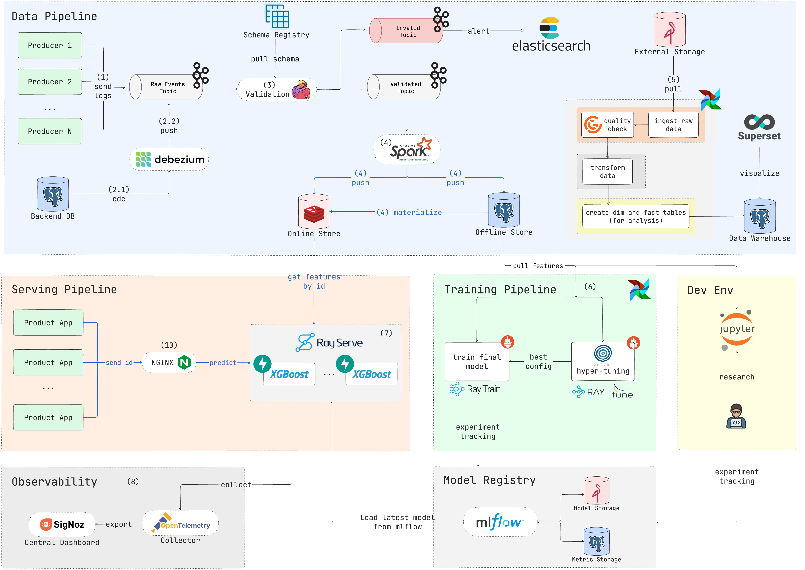

# Easy Data Pipeline



## Start Network

```
make up-network
```

## Kafka

```
make up-kafka
```

## Setup Connectors

```
make deploy_s3_connector
```

## Test Flink

### Start Producer

```
# JSON
make producer_json

# Avro
make producer_avro
```

### Start Consumer

```
make consumer
```

### Deploy Kafka Connect S3 Sink Connector

```
python3 -m src.streaming.connectors.deploy_s3_connector
```
