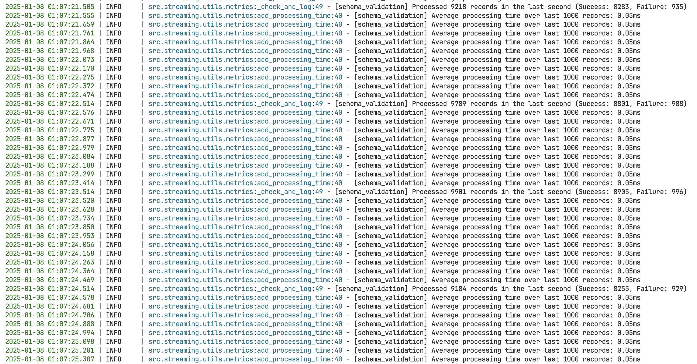
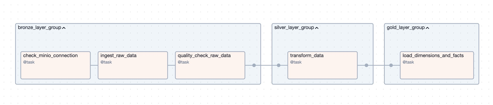

# 🚀 EasyMLOps

A turnkey MLOps pipeline demonstrating how to go from raw events to real-time predictions at scale. This project leverages modern data engineering and ML platforms—including Kafka, Flink, Redis, Ray, and more—to provide an end-to-end solution for data ingestion, validation, training, serving, and observability.


## 📑 Table of Contents

- [🌐 Architecture Overview](#-architecture-overview)
  - [1. Data Pipeline](#1-data-pipeline)
    - [📤 a. Producers & CDC](#a-producers--cdc)
    - [✅ b. Validation Service (Flink)](#b-validation-service-flink)
    - [☁️ c. DataLake (MinIO)](#c-datalake-minio)
    - [🏢 d. Data Warehouse (PostgreSQL)](#d-data-warehouse-postgresql)
    - [🛒 e. Online Store (Redis)](#e-online-store-redis)
  - [2. Training Pipeline](#2-training-pipeline)
    - [🌟 a. Distributed Training with Ray](#a-distributed-training-with-ray)
    - [📦 b. Model Registry](#b-model-registry)
    - [📝 c. Manual Training Option](#c-manual-training-option)
  - [3. Serving Pipeline](#3-serving-pipeline)
    - [⚡ a. Real-Time Inference (Ray Serve)](#a-real-time-inference-ray-serve)
    - [🔍 b. Feature Retrieval Services](#b-feature-retrieval-services)
    - [📈 c. Scalability & Performance](#c-scalability--performance)
  - [4. Observability](#4-observability)
    - [📡 a. OpenTelemetry Collector](#a-opentelemetry-collector)
    - [📊 b. SigNoz](#b-signoz)
    - [📉 c. Prometheus & Grafana](#c-prometheus--grafana)
  - [🛠️ Dev Environment](#dev-environment-🛠️)
    - [📓 a. Jupyter Notebooks](#a-jupyter-notebooks-📓)
    - [🐳 b. Docker Compose Services](#b-docker-compose-services-🐳)
  - [Model Registry](#model-registry)
    - [🖥️ a. MLflow UI](#a-mlflow-ui-🖥️)
    - [📁 b. MinIO](#b-minio-📁)
- [📊 Sequence Diagrams](#-sequence-diagrams)
  - [Sequence Diagram for Data Flow and Validation](#sequence-diagram-for-data-flow-and-validation)
  - [Sequence Diagram for Model Training and Serving](#sequence-diagram-for-model-training-and-serving)
- [⚙️ Usage](#-usage)
- [📖 Details](#-details)
  - [🔧 Setup Environment Variables](#setup-environment-variables-🔧)
  - [🏁 Start Data Pipeline](#start-data-pipeline-🏁)
  - [✅ Start Schema Validation Job](#start-schema-validation-job-✅)
  - [☁️ Start Data Lake](#start-data-lake-☁️)
  - [🔄 Start Orchestration](#start-orchestration-🔄)
  - [Data and Training Pipeline](#data-and-training-pipeline)
    - [🔄 Data Pipeline](#-data-pipeline-🔄)
    - [🤼‍♂️ Training Pipeline](#-training-pipeline-🤼‍♂️)
    - [📦 Start Online Store](#-start-online-store-📦)
  - [🚀 Start Serving Pipeline](#-start-serving-pipeline-🚀)
  - [🔎 Start Observability](#-start-observability-🔎)
    - [📈 Signoz](#signoz-📈)
    - [📉 Prometheus and Grafana](#prometheus-and-grafana-📉)
  - [🔒 NGINX](#nginx-🔒)
- [📃 License](#-license)

## 🌐 Architecture Overview

The system comprises four main pipelines—**Data**, **Training**, **Serving**, and **Observability**—alongside a **Dev Environment** and a **Model Registry**.

---

### 1. Data Pipeline

#### 📤 a. Producers & CDC

- Multiple producers emit raw events to **Kafka** (`tracking.raw_user_behavior`).
- A **Debezium-based CDC** service captures and streams changes from PostgreSQL into **Kafka** (`tracking_postgres_cdc.public.events`).

#### ✅ b. Validation Service (Flink)

- Consumes raw and CDC events from Kafka.
- Validates schemas, splitting events into:
  - **Validated Topic** (`tracking.user_behavior.validated`)
  - **Invalidated Topic** (`tracking.user_behavior.invalid`)

#### ☁️ c. DataLake (MinIO)

- **Kafka → S3 Sink Connectors** write validated and invalid data to **MinIO**.
- No data is lost—this approach follows `EtLT` (Extract, transform, Load, Transform).
- Ensures permanent storage of both raw and invalid events for alerting or recovery.

#### 🏢 d. Data Warehouse (PostgreSQL)

- **Airflow DAGs** orchestrate the ETL flow (Bronze → Silver → Gold tables):
  - Ingest raw data from MinIO.
  - Perform quality checks and transformations.
  - Create dimension, fact, and feature tables.
  - Re-check data quality on final “gold” tables.

#### 🛒 e. Online Store (Redis)

- Real-time ingestion of features:
  - **Flink Jobs** or custom Python scripts convert validated events into feature-ready topics.
  - **Feast** or custom ingestion pipelines populate Redis for low-latency feature retrieval.

---

### 2. Training Pipeline

#### 🌟 a. Distributed Training with Ray

- **`load_training_data`**: Pulls features from the “gold” tables in the Data Warehouse.
- **`tune_hyperparameters`**: Uses **Ray Tune** for distributed hyperparameter optimization.
- **`train_final_model`**: Trains the final model (e.g., XGBoost) using the best hyperparameters.

#### 📦 b. Model Registry

- **MLflow + MinIO** to store model artifacts, metrics, and versioned checkpoints.
- Facilitates model discovery, lineage, and rollout/rollback.

#### 📝 c. Manual Training Option

- **Jupyter notebooks** (`notebook/train.ipynb`) provide custom or ad hoc workflows.

---

### 3. Serving Pipeline

#### ⚡ a. Real-Time Inference (Ray Serve)

- **Ray Serve** hosts the trained model.
- Model checkpoints loaded from **MLflow** in MinIO.
- Real-time features fetched from **Redis** (Online Store).

#### 🔍 b. Feature Retrieval Services

- A dedicated microservice (e.g., **FastAPI**) or Flink job for on-demand feature retrieval.
- Streams or scheduled updates keep **Redis** current.

#### 📈 c. Scalability & Performance

- **Ray Serve** scales horizontally under heavy workloads.
- **NGINX** acts as a reverse proxy, routing requests efficiently.

---

### 4. Observability

#### 📡 a. OpenTelemetry Collector

- Collects, aggregates, and exports metrics, logs, and traces from various services.

#### 📊 b. SigNoz

- Consumes telemetry data from the OpenTelemetry Collector.
- Offers dashboards and alerting for monitoring the entire pipeline.

#### 📉 c. Prometheus & Grafana

- Scrapes and visualizes **Ray Cluster** metrics.
- Provides insights into resource usage, job status, and cluster health.

---

### 🛠️ Dev Environment

#### 📓 a. Jupyter Notebooks

- Facilitates data exploration, rapid prototyping, and debugging.
- Integrated with the rest of the pipeline for end-to-end local development.

#### 🐳 b. Docker Compose Services

- Local spins of **Kafka**, **Flink**, **Redis**, **Airflow**, etc.
- Simplifies debugging and testing by emulating production environments.

---

### Model Registry

#### 🖥️ a. MLflow UI

- Access at `localhost:5001`.
- Stores experiment runs, parameters, metrics, and artifacts.

#### 📁 b. MinIO

- Serves as the artifact storage backend for MLflow.
- Manages versioned model binaries and other metadata.

---

By combining streaming ingestion (**Kafka** + **Flink**), persistent storage (**MinIO** + **PostgreSQL**), orchestration (**Airflow**), distributed training/serving (**Ray**), and observability (**SigNoz**, **Prometheus/Grafana**), **EasyMLOps** provides a robust, modular pipeline—from raw data to real-time predictions at scale.

---

## 📊 Sequence Diagrams

### Sequence Diagram for Data Flow and Validation


### Sequence Diagram for Model Training and Serving


---

## ⚙️ Usage

All available commands can be found in the `Makefile`.

---

## 📖 Details

In this section, we will dive into the details of the system.

### 🔧 Setup Environment Variables

Please run the following command to setup the `.env` files:

```bash
cp .env.example .env
cp ./src/cdc/.env.example ./src/cdc/.env
cp ./src/model_registry/.env.example ./src/model_registry/.env
cp ./src/orchestration/.env.example ./src/orchestration/.env
cp ./src/producer/.env.example ./src/producer/.env
cp ./src/streaming/.env.example ./src/streaming/.env
```

**Note**: I don't use any secrets in this project, so run the above command and you are good to go.

### 🏁 Start Data Pipeline

I will use the same network for all the services, first we need to create the network.

```bash
make up-network
```

#### 🐟 Start Kafka

```bash
make up-kafka
```

The last service in the `docker-compose.kafka.yaml` file is `kafka_producer`, this service acts as a producer and will start sending messages to the `tracking.raw_user_behavior` topic.

To check if Kafka is running, you can go to `localhost:9021` and you should see the Kafka dashboard. Then go to the `Topics` tab and you should see `tracking.raw_user_behavior` topic.


To check if the producer is sending messages, you can click on the `tracking.raw_user_behavior` topic and you should see the messages being sent.


Here is an example of the message's value in the `tracking.raw_user_behavior` topic:

```json
{
  "schema": {
    "type": "struct",
    "fields": [
      {
        "name": "event_time",
        "type": "string"
      },
      {
        "name": "event_type",
        "type": "string"
      },
      {
        "name": "product_id",
        "type": "long"
      },
      {
        "name": "category_id",
        "type": "long"
      },
      {
        "name": "category_code",
        "type": ["null", "string"],
        "default": null
      },
      {
        "name": "brand",
        "type": ["null", "string"],
        "default": null
      },
      {
        "name": "price",
        "type": "double"
      },
      {
        "name": "user_id",
        "type": "long"
      },
      {
        "name": "user_session",
        "type": "string"
      }
    ]
  },
  "payload": {
    "event_time": "2019-10-01 02:30:12 UTC",
    "event_type": "view",
    "product_id": 1306133,
    "category_id": "2053013558920217191",
    "category_code": "computers.notebook",
    "brand": "xiaomi",
    "price": 1029.37,
    "user_id": 512900744,
    "user_session": "76b918d5-b344-41fc-8632-baf222ec760f"
  }
}
```

#### 🔄 Start CDC (2)

```bash
make up-cdc
```

Next, we start the CDC (Change Data Capture) service using Docker Compose. This setup includes the following components:

- Debezium: Monitors the Backend DB for any changes (inserts, updates, deletes) and captures those changes.
- PostgreSQL: The database where the changes are being monitored.
- A Python service: Registers the connector, creates the table, and inserts the data into PostgreSQL.

Steps involved:

- Debezium monitors the Backend DB for any changes. (2.1)
- Debezium captures these changes and pushes them to the Raw Events Topic in the message broker. (2.2)

The data is automatically synced from PostgreSQL to the `tracking_postgres_cdc.public.events` topic. To confirm this, go to the `Connect` tab in the Kafka UI; you should see a connector named `cdc-postgresql`.


Return to `localhost:9021`; there should be a new topic called `tracking_postgres_cdc.public.events`.


### ✅ Start Schema Validation Job

```bash
make schema_validation
```

This is a Flink job that will consume the `tracking_postgres_cdc.public.events` and `tracking.raw_user_behavior` topics and validate the schema of the events. The validated events will be sent to the `tracking.user_behavior.validated` topic and the invalid events will be sent to the `tracking.user_behavior.invalid` topic, respectively. For easier understanding, I don't push these Flink jobs into a Docker Compose file, but you can do it if you want. Watch the terminal to see the job running, the log may look like this:



We can handle `10k RPS`, noting that approximately `10%` of events are failures. I purposely make the producer send invalid events to the `tracking.user_behavior.invalid` topic. You can check this at line `127` in `src/producer/produce.py`.

After starting the job, you can go to `localhost:9021` and you should see the `tracking.user_behavior.validated` and `tracking.user_behavior.invalid` topics.


### 🔄 Transformation Job (4)

First, we need to start the Data Warehouse and the Online Store.

```bash
make up-dwh
make up-online-store
```

#### 📦 Data Warehouse

The Data Warehouse is just a **PostgreSQL** instance.

#### 📦 Online Store

The Online Store is a **Redis** instance.

Look at the `docker-compose.online-store.yaml` file, you will see 2 services, the `redis` service and the `feature-retrieval` service. The `redis` service is the Online Store, and the `feature-retrieval` service is the Feature Retrieval service.

The `feature-retrieval` service is a Python service that will run the following commands:

```bash
python api.py # Start a simple FastAPI app to retrieve the features
```

To view the Swagger UI, you can go to `localhost:8001/docs`. But before that, you need to run the `ingest_stream` job.

#### 🔄 Spark Streaming Job

Then, we need to start the transformation job.

```bash
make ingest_stream
```

This is a **Spark Streaming** job that consumes events from the `tracking.user_behavior.validated` topic. It transforms raw user behavior data into structured machine learning features, focusing on session-based metrics and purchase behavior. The transformed data is then **pushed to both online and offline feature stores**, enabling real-time and batch feature serving for ML models. Periodically, the data is materialized to the online store.

The terminal will look like this:


Beside that, you can use any tool to visualize the offline store, for example, you can use `DataGrip` to connect to the `dwh` database and you should see the `feature_store` schema.


### 🔄 Data and Training Pipeline (5 & 6)

```bash
make up-orchestration
```

This will start the Airflow service and the other services that are needed for the orchestration. Here is the list of services that will be started:

- MinIO (Data Lake)
- PostgreSQL (Data Warehouse)
- Ray Cluster
- MLflow (Model Registry)
- Prometheus & Grafana (for Ray monitoring)

**Relevant URLs:**

- 🔗 Airflow UI: `localhost:8080` (user/password: `airflow:airflow`)
- 📊 Ray Dashboard: `localhost:8265`
- 📉 Grafana: `localhost:3009` (user/password: `admin:admin`)
- 🖥️ MLflow UI: `localhost:5001`

Go to the Airflow UI (default user and password is `airflow:airflow`) and you should see the `data_pipeline` and `training_pipeline` DAGs. These 2 DAGs are automatically triggered, but you can also trigger them manually.


#### 🔄 Data Pipeline (5)

##### Data Lake

Data from external sources is ingested into the Data Lake, then transformed into a format suitable for the Data Warehouse for analysis purposes.

To make it simple, I used the data from the `tracking.user_behavior.validated` topic in this `data_pipeline` DAG. To end this, we first start the Data Lake, then we create a connector to ingest the data from the `tracking.user_behavior.validated` topic to the Data Lake.

```bash
make up-data-lake
```

The Data Lake is a **MinIO** instance, you can see the UI at `localhost:9001` (user/password: `minioadmin:minioadmin`).

Next, we need to create a connector to ingest the data from the `tracking.user_behavior.validated` topic to the Data Lake.

```bash
make deploy_s3_connector
```

To see the MinIO UI, you can go to `localhost:9001` (default user and password is `minioadmin:minioadmin`). There are 2 buckets, `validated-events-bucket` and `invalidated-events-bucket`, you can go to each bucket and you should see the events being synced.


Each record in buckets is a JSON file, you can click on the file and you should see the event.


##### Data Pipeline

The `data_pipeline` DAG is divided into three layers:



###### Bronze Layer:

1. **ingest_raw_data** - Ingests raw data from the Data Lake.
2. **quality_check_raw_data** - Performs validations on the ingested raw data, ensuring data integrity.

###### Silver Layer:

3. **transform_data** - Cleans and transforms validated raw data, preparing it for downstream usage.

###### Gold Layer:

4. **create dim and fact tables** - Creates dimension and fact tables in the Data Warehouse for analysis.

Trigger the `data_pipeline` DAG, and you should see the tasks running. This DAG will take some time to complete, but you can check the logs in the Airflow UI to monitor the progress. For simplicity, I hardcoded the `MINIO_PATH_PREFIX` to `topics/tracking.user_behavior.validated/year=2025/month=01`. Ideally, you should use the actual timestamp for each run. For example, `validated-events-bucket/topics/tracking.user_behavior.validated/year=2025/month=01/day=07/hour=XX`, where XX is the hour of the day.

I also use checkpointing to ensure the DAG is resilient to failures and can resume from where it left off. The checkpoint is stored in the Data Lake, just under the `MINIO_PATH_PREFIX`, so if the DAG fails, you can simply trigger it again, and it will resume from the last checkpoint.

#### 🤼‍♂️ Training Pipeline (6)

The `training_pipeline` DAG is composed of these steps:


1. **Load Data** - Pulls processed data from the Data Warehouse for use in training the machine learning model.
2. **Tune Hyperparameters** - Utilizes Ray Tune to perform distributed hyperparameter tuning, optimizing the model's performance.
3. **Train Final Model** - Trains the final machine learning model using the best hyperparameters from the tuning phase.
4. **Save Results** - Saves the trained model and associated metrics to the Model Registry for future deployment and evaluation.

Trigger the `training_pipeline` DAG, and you should see the tasks running. This DAG will take some time to complete, but you can check the logs in the Airflow UI to see the progress.


After hitting the `Trigger DAG` button, you should see the tasks running. The `tune_hyperparameters` task will be `deferred` because it will submit the Ray Tune job to the Ray Cluster and use polling to check if the job is done. The same happens with the `train_final_model` task.

When the `tune_hyperparameters` or `train_final_model` tasks are running, you can go to the Ray Dashboard at `localhost:8265` and you should see the tasks running.


Click on the task and you should see the task details, including the id, status, time, logs, and more.


To see the results of the training, you can go to the MLflow UI at `localhost:5001` and you should see the training results.


The model will be versioned in the Model Registry, you can go to `localhost:5001` and hit the `Models` tab and you should see the model.


### 🚀 Start Serving Pipeline (7)

```bash
make up-serving
```

This command will start the Serving Pipeline. Note that we did not port forward the `8000` port in the `docker-compose.serving.yaml` file, but we just expose it. The reason is that we use Ray Serve, and the job will be submitted to the Ray Cluster. That is the reason why you see the port `8000` in the `docker-compose.serving.ray` file instead of the `docker-compose.serving.yaml` file.


### 🔎 Start Observability (8)

#### 📈 Signoz

```bash
make up-observability
```

This command will start the Observability Pipeline. This is a SigNoz instance that will receive the data from the OpenTelemetry Collector. Go to `localhost:3301` and you should see the SigNoz dashboard.


#### 📉 Prometheus and Grafana (9)

To see the Ray Cluster information, you can go to `localhost:3009` (user/password: `admin:admin`) and you should see the Grafana dashboard.


**Note**: If you dont see the dashboards, please remove the `tmp/ray` folder and then restart Ray Cluster and Grafana again.

### 🔒 NGINX (10)

```bash
make up-nginx
```

This command will start the **NGINX Proxy Manager**, which provides a user-friendly interface for configuring reverse proxies and SSL certificates. Access the UI at `localhost:81` using the default credentials:

- Username: `admin@example.com`
- Password: `changeme`

Key configuration options include:

- Free SSL certificate management using:
  - Let's Encrypt
  - Cloudflare SSL
- Free dynamic DNS providers:
  - [DuckDNS](https://www.duckdns.org/)
  - [YDNS](https://ydns.io/)
  - [FreeDNS](https://freedns.afraid.org/)
  - [Dynu](https://www.dynu.com/)
- Setting up reverse proxies for services like Signoz, Ray Dashboard, MLflow, and Grafana.

**Security Tip**: Change the default password immediately after first login to protect your proxy configuration.


---

## Contributing

This project is open to contributions. Please feel free to submit a PR.

## 📃 License

This project is provided under an MIT license. See the [LICENSE](LICENSE) file for details.
